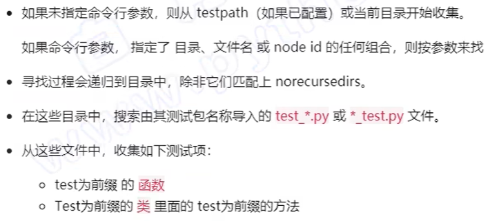

# PyTest基础

> Author: Sylvie233
>
> Date: 23/1/26
>
> Point: 

[TOC]

## 基础介绍

安装：

```
pip install pytest
pip install pytest-html
```


测试用例：




初始化清除：

目录、模块、类、方法

```
# 模块级别
setup_module():
tesardown_module():

# 类级别
@classmethod
setup_class(cls):
@classmethod
teardown_class(cls):

# 方法级别
setup_method():
teardown_method():
```


### conftest.py

```

@pytest.fixture(
	scope= package|
	autouse
)
def xxx():
	yield 
	
	
# 设置整个模块的标签
pytestmark = []
```


### pytest

```
pytest:
	-k: 指定测试用例（根据名字）
		and|or|not|
	-m: 指定测试用例（根据标签）
	-s: 显示控制台输出
	-v: 显示详细的执行信息
	--html:
	--self-contained-html:
```


## 核心内容

## API(pytest)

### fixture

### mark

```
mark:
	parametrize():
```

