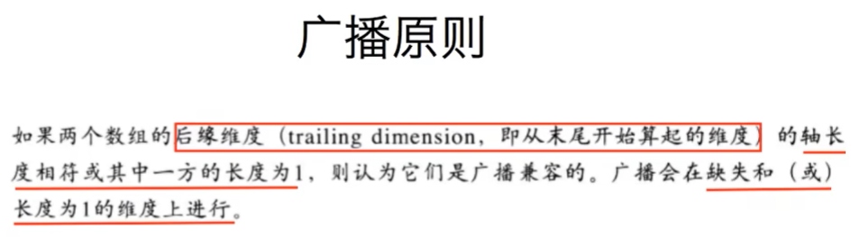

# Numpy基础

>Author: Sylvie233
>
>Date: 2022/11/27
>
>Point:  

[TOC]

## 基础介绍

数据分析工具


## Numpy

安装：

```

```


科学计算的基础库，重在数值计算


ndarray

运算的广播机制

维度相同的广播计算




### 常用API

```
numpy:
	nan: 浮点类型
	arange(): 范围生成
		start:
		stop:
		step:
	array(): np数组生成
		dtype: 类型
	eye(): 对角线
	inf: 浮点类型
	ones():
	random:
        normal():
        rand():
        randn():
        ranint():
        seed():
        uniform():
	zeros(): 
	----------------------------
	argmax(): 维度最大值索引
		axis: 维度（0、1、2）
	argmin():
	clip(): 值范围裁剪
	copy(): 复制拷贝
	count_nonzero(): 非零计数
	hstack(): 列添加
	isnan(): 
	mean(): 平均值
		axis
	median(): 中位数
	ptp(): 极值差
	round(): 
	std(): 标准差
	sum(): 和
	vstack(): 行添加
	where(): 条件赋值	
	
	----------------------------
	loadtxt(): 读取文件
		frame: 文件
		dtype:
		delimiter:
		skiprows: 跳过前n行
		usecols: 读取指定列
		unpack: 按列读（转置）
	 

ndarray:
	dtype: 类型（int64/bool/int32/float32/i1/f4/d/complex64）
	shape: 形状
	T: 转置
	[]: 切片
		start:
		end:
		step:
		,: 维度分隔
    ----------------------------
	astype(): 类型转换
	flatten(): 展开
	reshape(): 形状改变
		-1: 待定
	max():
	min():
	swapaxes(): 交换轴
	transpose(): 转置
```


## Pandas

安装：

```


import pandas as pd
```


series、dataframe（series容器）

交叉表


布尔索引：

&、|


nan值不会参与运算


### 常用API

```
pandas(pd):
	nan:
    crosstab(c1, c2): （c1为新行、c2为新列）
    date_range(): 时间索引
    	start:
    	end:
    	freq:
    	periods:
    	return: DatetimeINdex
    DataFrame(): 数据框
    	data: 
    	index: 行索引
    	columns: 列索引
    PeriodInde(): 时间字段合并索引
    	year:
        month:
        day:
		hour:
		freq:
    Series(): 序列
    	index: 索引指定
    --------------------------------
	dot(): 矩阵内积
		a:
		b:
	DatetimeIndex(): 日期格式拆分
	isnull():
	to_datetime(): 时间字符串转为时间序列
		date:
		unit: 's'/
		format:
	merge(t1, t2, on=[k1, k2])
	multiply(): 乘法
		a:
		b:
	notnull():
	--------------------------------
	read_csv():
		names: []（列名）
	read_sql(): sql执行数据
	 
	 
string: 字符串
	cat():
	center():
	contains():
	count():
	endswith():
	findall():
	get():
	join():
	len():
	lower():
	lstrip():
	match():
	pad():
	replace():
	rstrip():
	split():
	startswith():
	strip():
	upper():
	
Series: （带标签的一维数组）
	dtype:
	index: 索引Index
	values: 值
	str: 字符串
	[]: 切片/索引index
	
	argmax():
	argmin():
	astype():
	groupby():
		by: 列值可按其他列中的值进行分组
	max():
	mean():
	median():
	min():
	unique(): 去重（列表）
	where():
	
DataFrame: 数据框（二维，多维Series（列），类似数据库的表）
	shape:
	dtypes:
	index: 行索引
		Index:
			levels: 索引值
			labels: 索引标签
			names: 索引名
	columns: 列索引
	values: np.array类型
	ndim: 数据维度
	[]: 切片/索引（列索引为Series，df[行索引]["列索引"]）
	
	count(): 计数
	describe(): 快速综合统计结果（计算、平均值、标准差、中位数）
	drop(): 删除列
		[列名]:
		axis:
	dropna(): 删除na行
		axis: 0行、1列
		how: any/all
		inplace:
	fillna(): 缺失值填充
	groupby(): 分组 
		by: 列索引
		return: DataFrameGroupBy（每个元素是个元组）
			(列值, df（分组后的df）)
			
		count(): （返回每个分组的count()）
		max():
		mean():
		median():
		min():
		std:():
		sum():
		var():
	head(n): 查看前n行
	iloc[]: 根据位置索引数据
	info(): 相关信息（行数、列数、）
	isin(): in过滤
	join(): 默认按行索引相同合并
	loc[]: 根据标签索引数据 
	mean(): 平均值
	merge(): 按字段连接（默认inner）
		df:
		on: 列索引
		left_on:
		right_on:
		how: inner/outer/left/right
	query(): 条件查询
	reindex(): 重置index
		
	replace(): 替换
		to_replace: 待替换的值
		value: 替换填充值
	resample(): 重采样（时间聚合）
		
		count():
		
	reset_index(): 重置index列
		drop: 是否从df中删除该索引列（默认true）
	reshape():
	set_index(): 使指定列的值成为索引
	sort_values(): 排序
		by: 列索引名
		ascending: 升序
	sum(): 求和
		axis: 0所有行（剩列）
	swaplevel(): 交换索引层级
	tail(): 
	

```


## Matplotlib

安装：

```

```


数据可视化工具


### 常用API

```
matplotlib:
	font_manager: 字体管理
		FontProperties: 字体属性
			fname: 字体文件
	pyplot: 画图类（plt）
		bar(): 条形图
			x:
			data:
			height:
			width: 宽度（可传入数组[]）
			align:
		barh(): 水平条形图
			x:
			data:
			height:
			width:
		figure(): 生成画布
			figsize: (w, h)（图像大小）
			dpi: 图像深度（像素点）
		grid(): 网格
			alpha: 透明度
		hist(): 直方图（没有经过统计的数据，自动计数）
			x:
			bins: 组数（或者刻度列表[]）
			data: 
			normed: 频率直方图 
		legend(): 图例
			prop: 字体
			loc: 位置（upper、left、）
		plot(): 折线图
			x: []
			y: []
			label: 标签
			color: 线条
			linestyel: 线条风格（--、:、）
			linewidth: 线宽
			alpha: 透明度
		savefig(): 保存图像
			file: 文件路径
			
		scatter(): 散点图
			x: []
			y: []
			color: 颜色
			label: 标签
		show(): 绘图
		title(): 标题
		xlabel(): x轴描述
		xticks(): 轴刻度线
			ticks: [] 自定义刻度
			labels: [] 自定义标签
            step: 步长（间隔）
            rotation: 旋转
            fontproperties: 字体属性
        ylabel(): y轴描述
        yticks():
        	ticks:
        	labels:
    rc: 应用配置
		font: {family、weight、size} 字体配置
```


