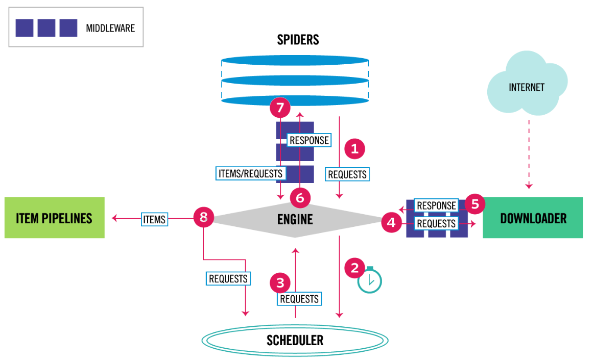

# Scrapy基础

> Author: Sylvie233
>
> Date: 23/2/3
>
> Point: P53

[TOC]

## 基础介绍

Scrapy架构




### 项目目录

```
scrapy:
	/项目:
		/spiders: 爬虫
			__init__.py:
			xxx爬虫.py: 爬虫逻辑
		__init__.py:
		items.py: 数据格式定义
		middlewares.py:
		pipelines.py:
		settings.py: 配置
	scrapy.cfg:
```


#### spiders/\_\_init\_\_.py

```
:
	start_request():
```


#### settings.py

```
BOT_NAME = ""

CONCURRENT_REQUESTS = 32

DOWNLOADER_MIDDLEWARES = {
	"xxx.middlewares.XxxMiddleware": order值
}

EXTENSIONS = {
	"scrapy.extensions.corestats.CoreStats": None
}

ITEM_PIPELINES = {
	"x.pipelines.XxxPipeline": order值
}

ROBOTSTXT_OBEY = True

SPIDER_MIDDLEWARES = {
	"xxx.middlewares.XxxMiddleware": order值
}

SPIDER_MODULES = ["xxx.spiders"]

```


### scrapy

```
scrapy:
	crawl: 运行指定爬虫
	edit:
	fetch:
	genspider:
	list:
	runspider: 运行指定文件
		-o: 指定输出文件
		-t: 输出文件类型
    settings:
	shell:
	startproject:
	version:
	view:
```


### scrapy-shell

```
shell:
	crawler: 
	request:
		callback:
	reponse:
	scrapy:
	settings:
		
	spider:
		parse():
	fetch():
	shelp():
	view():
```


### scrapy-redis


## 核心内容

### Pipeline

每个Spider的处理钩子函数

items处理


```
Pipeline:
	open_spider(self, spider):
	process_item(self, item, spider):
		return item
	close_spider(self, spider):
```


### Middleware

Request下载成功后的响应处理函数、在Pipeline处理之前

Items、Requests


Downloader Middleware中间件

Spider Middleware中间件


信号机制

```
DownloaderMiddleware:
	process_request(self, request, spider):
	process_response(self, request, response, spider):
	process_exception(self, request, exception, spider):
	
	# 注册信号处理函数
	@classmethod
	from_crawler(cls, crawler):
		s = cls()
		crawler.signals.connect(handler, siganl=signals.spider_opened)
		return s
		
		
SpiderMiddleware:
	
```


#### 内建中间件

```
downloadermiddlewares:
	RobotsTxtMiddleware:
	HttpAuthMiddleware:
	DownloadTimeoutMiddleware:
	DefaultHeadersMiddleware:
	UserAgentMiddleware:
	RetryMiddleware:
	MetaRefreshMiddleware:
	HttpCompressionMiddleware:
	RedirectMiddleware:
	CookiesMiddleware:
	HttpProxyMiddleware:
	DownloaderStats,
	HttpCacheMiddleware
	
spidermiddlewares:
	HttpErrorMiddleware:
```


### Extension

signal信号机制


6023端口telnet

```
telnet:
	est():
```


## API

### scrapy

```
scrapy:
	Field:
	Item:
		fields:
	Spider:
		allowed_domains: []
		logger:
			info():
		name:
		start_urls: []
		parse():
			():
				response:
					css():
					follow():
					replace():
					xpath():
        start_requests():
	downloadermiddlewares:
		DownloaderMiddleware:
	exceptions:
		DropItem:
	extensions:
		telnet:
			TelnetConsole:
	http:
		request:
			Request:
				body:
				callback:
				dont_filter:
				encoding:
				errback;
				flags:
				headers:
				meta:
					proxy:
				priority:
				url:
		response:
			Response:
				meta:
			html:
				HtmlResponse:
			text:
				TextResponse:
	settings:
		Settings:
			getbool():
			getlist():
	signals:
		item_dropped:
		item_scraped:
		response_received:
		spider_closed:
		spider_opened:
	spidermiddlewares:
```


## 应用场景


