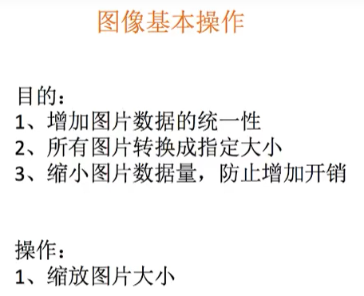
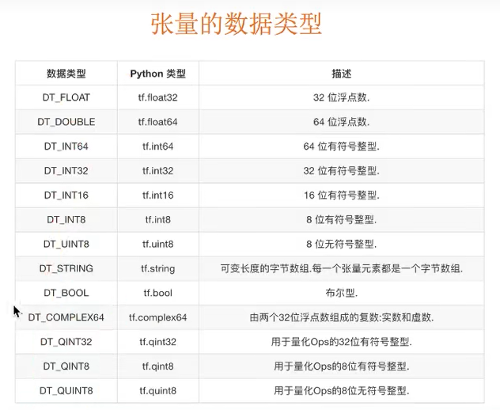
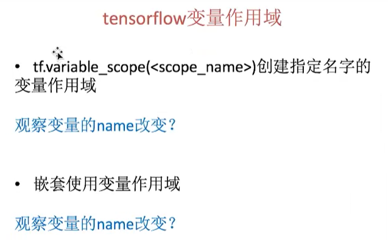
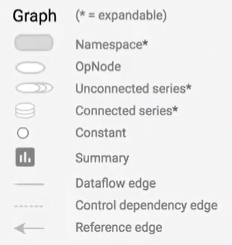

# TensorFlow基础

>Author: Sylvie233
>
>Date: 2022/11/29
>

[TOC]

## 基础介绍

应用领域：

1. 图像识别
2. 语音识别
3. 自然语言处理
4. 机器自主


卷积神经网络、循环神经网络


CPU、GPU版本


数据流图


placeholder提供占位符，run()时提供值


图片数据：

\[height, width, channels]




tfrecords文件：

Example协议块


### 张量

tensor，Tensorflow基本的数据类型

```
Tensor{"name", shape={}, dtype}
```

底层是numpy的ndarray

阶、数据类型

张量的形状


基础数据类型




### 操作

operation操作（计算单位）


默认会给运算符重载成op类型


形状的改变shape

动态形状、静态形状（是否生成新的张量）


操作的依赖性、延迟性


### 变量

特殊的张量，能够进行存储持久化，值是张量

会话运行时需要初始化

模型的参数必须用变量定义

变量作用域：




### 数据流图

一张图包含了一组op和tensor


### 会话

session

只能运行一张图


### 模型


## 常用API

### app

```
tensorflow.app:
	flags: 命令行参数工具
		DEFINE_integer():
			name: 参数名
			default_value: 默认值
			desc:
		DEFINE_string(): 字符串类型参数
		FLAGS: 所有命令行参数
			xxx: 获取定义的参数
```


### contrib

```
tensorflow.contrib:

```


### examples

```
tensorflow.examples:

tensorflow.examples.tutorials.minist:
	input_data:
		read_data_sets():
			
			
```


### graph

```
graph:
	as_default():
```


### layers

提供高层的神经网络，对nn的进一步封装

```
tensorflow.layers:

```


### nn

提供神经网络相关操作的支持，包括：卷积操作conv、池化操作pooling、归一化、loss、分类操作、embedding、RNN、Evaluation

```
tensorflow.nn:
	conv2d(): 卷积
		input: 输入（[batch, w, h, ch]）
		filter: 过滤器大小（卷积核大小）（[h,w,in_ch（对应输入通道数）,out_ch（类似过滤器个数）]）
		strides: 步长（[1,stride,stride,1)）（对应input）
		padding: 填充（SAME（使得变化后w，h一样大（跟输入一样大））/VALID）
		
	max_pool(): 池化
		value: 输入数据（[batch,h,w,ch]）
		ksize: 池化窗口（[1,h,w,1]）
		strides: 步长（[1,stride,stride,1]）
		padding: 填充
		
	relu(): relu激活函数
		features: （卷积后加上偏置的结果）
	
	softmax_cross_entropy_with_logits():
		labels: 标签值（真实值）
		logits: 样本加权之后的值（计算后的值）
		return: 损失值列表
```


### image

```
tf.image:
	decode_jpeg():
		return: image的tensor（Tensor(shape=(?,?,?), dtype=uint8)）
	resize_images():
		images: 4D或3D：[batch, h, w, ch]/[h, w, ch]
		size: [w, h]设置宽高
		return: 设置好shape的image（type为float32）
	
```


### python_io

```
tensorflow.python_io:
	TFRecordWriter:
		path:
		
		write():
			record:
		close():
```


### session

tf.Session()创建

```
session:
	graph
	close():
	run():
		fetchs: 运行的tensor
		feed_dict: tensor值覆盖（placeholder占位符）
```


### summary

```
summary:
	FileWriter:
		():
			file:
			graph: 把指定的图写入文件中
			
		add_summary():
			summary: 运行结果（run()返回值）
			index: 第几次
	histogram(): 收集高纬度的变量参数
	image():
		name: 收集输入的图片张量
	merge_all(): 合并变量
	scalar(): 收集对于损失函数和准确率等单值变量
		name:
		tensor:
	
		
```


### tensor

```
tensor:
	graph:
	name: 
	op: 操作
	shape: 形状
	
	eval(): 执行获取值
	set_shape(): 设置形状（设置后不可修改、不能跨维度）（静态形状）
```


### tensorflow

```
tensorflow:
	float32:
	
	------------------------------
	summary:
	------------------------------
	constant(): 
	ConfigProto():
	FixedLengthRecordReader: 字节读取器
		record_bytes: 指定每次读取的字节数
		return:
		
		read():
			queue:
			return:
				key:
				value:
			
	FIFOQueue: 队列
		():
            capacity: 容量
            dtype: 对象列表
        
        dequeue():
        enqueue():
        enqueue_many():
        size(): 
       	
	Graph():
	InteractiveSession():
	ones():
	ones_like():
		tensor:
		dtype:
		name:
	placeholder():
	random_normal(): 随机张量生成
		shape:
		mean:
		stddev:
		dtype:
		seed:
		name:
	Session():
		config:
		graph: 指定图
	TextLineReader: 文件阅读器（一行）
	
	TFRecordReader: 读取TfRecords文件
		():
		
		read():
        	queue: 要读取的文件队列
			return:
				key:
				value: tensor的string类型
	
	Variable():
		initial_value:
		trainable: 是否可训练改变
	variable_scope():
		namespace: 作用域名
		
	WholeFileReader: 文件内容读取器（一张图片）
		():
		
		
		read():
			queue: 文件队列
			return:
                key:
                value: 图片数据（一张）
	zeros():
		shape: 形状
		dtype: 类型
		name: 名称
	------------------------------
	decode_csv():
		records: tensor字符串
		field_delim: 分隔符（,）
		record_defaults: record默认值（[[],[],...]）
		return:
			c1: 第一列数据
			c2: 第二列数据
			...: 第n列数据
		
		
	decode_raw(): 二进制解码
		value:
		type:
		
	parse_single_example():
    	serialized:
    	features: 字典（value为FixedLenFeature）（设置读取规则）
    	
    	return: features字典
		
	------------------------------
	string_to_number():
	to_double():
	to_float():
	to_int32():
	to_int64():
	------------------------------
	argmax(): 求样本最大值位置（列位置）
	assign_add(): 加法（修改加数，可迭代）
	add():
	cast(): 类型转换
		x:
		dtype:
		name:
    concat(): 拼接
    	values:
    	axis: （0: 增加行）
    equal():
    expand_dims():
	fill():
	get_default_graph():
	global_variables_initializer():
	matmul(): 矩阵乘
		a:
		b:
	one_hot(): one-hot编码
		depth: 编码长度
		axis: 轴（1,2）
	rank():
	reduce_mean(): 均值
	reshape(): 修改形状（生成新的张量）（动态形状）
		tensor: 
		shape:
    set_shape():
    	shape: [w, h, ch]
	shape():
	size():
	slice():
		value:
		startL:
		length:
	square(): 平方
	squeeze():
	start_queue_runners(): 收集所有图中的队列，并启动线程执行
		sesssion:
		coord:
	

	------------------------------
	


```


### train

```
tensorflow.train:
	batch(): 批处理数据
		tensors: 要读取的张量列表（[c1, c2, ...]）
		batch_size: 每批次读取的个数（可重复读取）
		num_threads: 线程个数
		capacity: 队列大小（流量控制）
		return: tensors
		
	BytesList:
		
	Coordinator: 线程协调员
		():
		
		join():
		request_stop():
		
	Example: Example协议块
		():
			features:特征实例
			
		SerializeToString(): 序列化
			
	Feature: 		
	Features: 信息键值对
		():
			feature: 字典kv（value为Feature）
	FixedLenFeature: 
		():
			shape:
			dtype:
			
	FloatList:

	GradientDescentOptimizer: 梯度下降
		learning_rate: 学习率
		
		minimize(): 执行运用
			loss: 损失
			
	Int64List:
	
	
			
	QueueRunner: 队列管理器
		():
			queue: 队列
			enqueue_ops: 队列操作
			
        create_threads(): 开启子线程（执行队列任务）
        	session:
        	start:
        	coord: 线程协调员
			
		
	
	Saver: 模型保存
		():
            var_list: 保存的变量
            max_to_keep: （checkpoint检测点文件，默认最新5个）
		
		save(): 保存
			session:
			file:
		restore(): 加载（覆盖模型中定义的参数）
			session:
			file:
	shuffle_batch():
	
	string_input_producer(): 生成文件队列
		string_tensor: 文件名列表
		num_epochs: 迭代次数
		return: 队列
```


## TensorBoard

程序图结构、序列化文件、events事件文件、

tensorboard命令

```
tensorboard:
	--logdir: 指定events文件目录
	
```

菜单项：


1. 
2. 图片
3. 音频
4. 图


图例：



 


