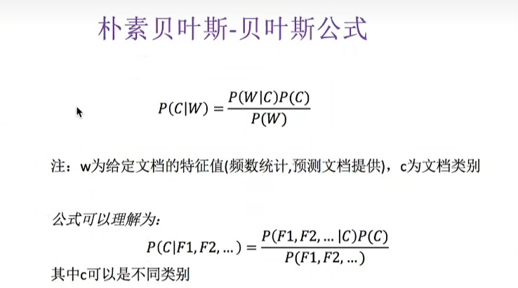

# 机器学习

>Author: Sylvie233
>
>Date: 2022/11/27
>
>Point: 黑马程序员7天学会机器学习与深度学习(P33)

[TOC]

## 基础介绍

**机器学习算法分类：**

输入数据有无标签：

1. 监督学习
   - 分类（离散型）：k-近邻算法、贝叶斯分类、决策树与随机森林、逻辑回归、<u>神经网络</u>
   - 回归（连续型）：线性回归、岭回归
   - 标注：隐马尔可夫模型
2. 无监督学习
   - 聚类：k-means、


机器学习领域：

1. 传统预测
2. 自然语言处理
3. 图像识别


分类问题、值预测、


用户数据、数据清洗、数据预处理、特征工程、机器学习、模型评估、离线/在线服务

numpy、pandas、sklearn、


数据集：

文件csv

scikit-learn、UCI、Kaggle可用数据集

特征值、目标值

sklearn数据集

.pkz文件


**特征工程：**特征提取、数据预处理（归一化、标准化）、数据降维

特征值化

sparse矩阵、scipy工具

one-hot编码、


文本特征提取：

文本分类、情感分析

中文处理：jieba分词

```
pip3 install jieba

import jieba

_str = jieba.cut("中文字符串")
_content= list(_str)
_str_new = ' '.join(_content)
```

文本分类：

tf：term frequency词频

idf：inverse document frequency逆文档频率（log(总文档数/该词出现的文档数)）

count、tf-idf算法

重要性=tf * idf


数据预处理：

特征预处理

通过特定的统计方法进行转换

1. 归一化、标准化、缺失值
2. one-hot编码
3. 时间的切分

归一化：映射到[0,1]之间

使得特征值的大小不会直接干扰目标值的判断

异常值处理

标准化：通过对原始数据进行变换，把数据变换到均值为0，方差为1的范围类（平均值、标准差）

使用标准化处理异常点

缺失值处理：删除、插补（平均数、中位数）

np.nan


数据降维：特征的数量

特征选择：

- 过滤式Filter：方差域、
- 嵌入式Embedded：正则化、决策树
- 包裹式Wrapper

神经网络特征选择

主成分分析

线性判别分析


### 转换器

fit_transform()转换数据集


### 估计器

模型训练、预测、预测的准确性


### 精确率

分类模型评估（准确率）


**对每个类别都有一个混淆矩阵**

**召回率**

 

**F1-Score**


### 交叉验证

训练集、验证集

数据n等分，n等分中训练集和验证集逐渐交换位置，共进行n次训练，结果值取n次交叉验证的平均值


**网格搜索**

调参数，使用交叉验证对超参数组进行评估，择优


## 核心算法

### 主成分分析

特征数据降维，

PCA

特征选择、数据降维、简化数据集 


### K-近邻算法

 根据邻居判断类别

特征空间k个最相似中所属类别最多的

欧氏距离


**k值的决定**（超参数，外面指定）


### 朴素贝叶斯

划分类别概率最大值（**特征之间（关键词）条件独立**）

联合概率、条件概率




训练统计训练集中的各类别的词频统计， 对被预测文档进行词频统计，计算各个类别的概率，最后选择概率最大的


拉普拉斯平滑系数，处理概率为0的情况


tf-idf词频统计：利用训练集建立词频列表 

训练集很大影响预测结果


### 决策树/随机森林

根据**信息增益大小对特征字段**的判断顺序进行**排序**

信息论、bit比特、信息熵、不确定性

决策树划分：

信息增益：当得知一个特征值的信息时，信息熵的减少的大小


信息熵：对目标值进行计算

条件熵：对该特征值的各个取值范围求信息熵，最后求和（Di为该特征值该取值范围拥有的个数）

信息增益：对各个特征值进行计算


决策树算法：


**减枝cart算法**

过拟合问题


**随机森林**

集成学习方法：<u>生成多个分类器/模型</u>，各自独立地学习和作出预测、这些预测最后结合成单预测

随机森林是一个包含多个决策树的分类器，并且其输出的类别是由个别树输出的类别的众数而定

建立多个决策树：

1. 随机在N个样本当中选择一个样本，重复N次（样本有可能重复）
2. 随机在M个特征当中选出m的特征
3. 完成一棵决策树的建立（重复1-3步骤）

有放回抽样

能够有效地运行在大数据集上


## Scikit-learn库

安装：

```
pip install Scikit-learn


```


算法：

1. 分类
2. 回归
3. 聚类
4. 降维
5. 模型选择
6. 特征工程


常用API

```
集成学习算法：(sklearn.ensemble)
sklearn.ensemble
	RandomForestClassifier: 随机森林
		():
			n_estimators: 树的个数
			criteria: 分割特征的测量方法
			max_depth: 
			max_features: 每个决策树的最大特征数量
			bootstrap: 是否有放回抽样

数据集：(sklearn.datasets)
sklearn.datasets
	load_*(): 小规模（iris、）
		load_iris():
		load_boston():
			
	fetch_*(): 大规模
		fetch_20newsgroups()
			subset: "all"/
	
    datasets.base.Bunch: 字典数据集
        data: 特征值
        target: 目标值（标签）
        DESCR:
        feature_names: 特征名
        target_names: 标签名

降维：(sklearn.decompostion)
sklearn.decomposition
	PCA: 主成分分析
		(n_components=小数/整数（降低比例）)
		fit_transform()

特征工程：(sklearn.feature_extraction)
sklearn.feature_extraction
	DictVectorizer: 字典特征提取
		(sparse=False, )
		get_feature_names()
		fit_transform(): 各行特征值的取值转换为one-hot编码，并生成对应列
		fit()

sklearn.feature_extraction.text
	CountVectorizer: 文本特征提取（词频统计）
		fit_transform()
		get_feature_names(): 
		inverse_transform(): 反向转换
		
	TfidfVectorizer: 词频重要性统计
		fit_transform():
		get_featur_names():

特征选择：(sklearn.feature_selection)
sklearn.feature_selection 
	VarianceThreshold: 删除低方差特征
		(threshold=1.0)
		fit_transform()

评估：(sklearn.metrics)
sklearn.metrics
	classification_report: 分类的精确率、召回率
		y_true: 真实目标值
		y_pred: 预测目标值
		target_names: 目标类别名称
		return: 每个类别的精确率和召回率

模型选择：(sklearn.model_selection)
sklearn.model_selection
	train_test_split(*arr（特征值）, *arr_2（目标值）, **opts): 数据集划分
		x: 特征值
		y: 目标值
		opts:
            test_size: 测试集大小
		return: (x_train, x_test, y_train, y_test)
	GridSearchCV: 网格搜索、交叉验证（超参数调优）
		():
            estimator: knn/
            param_grid: 估计器参数（字典设置每个超参数的数组[]值）
            cv: 几折交叉验证
        return:
        	best_score_: 交叉验证最好的结果
        	best_estimator: 最好的模型（超参数组合）
        	best_params: 最好的超参数组合
        	cv_results_: 每个超参数每次交叉验证的结果
		fit(): 训练数据
			x_train: 特征值
			y_train: 目标值
		score(): 准确率
			x_test: 测试集特征值
			y_test: 测试集目标值

朴素贝叶斯：(sklearn.naive_bayes)
sklearn.naive_bayes
	MultinomialNB: 朴素贝叶斯
		():
			alpha: 平滑系数
		fit():
			x_train:  
			y_train:
		predict():
			x_test: 待预测数据
			return: y_predict
		score(): 计算准确率
			x_test: 测试数据集特征值
			y_test: 测试数据集目标值

k-近邻：(sklearn.neighbors)
sklearn.neighbors
	KNeighborsClassifier: K-近邻算法
		():
			n_neighbors: 邻居数
			algorithm: （指定算法）
		fit():
			x: 特征值
			y: 目标值
		predict(): 预测数据
			x: 测试集特征值
			return: 预测的目标值
		score(): 准确率比较（直接再计算一次）
			x: 测试集特征值
			y: 测试集目标值
			
		

预处理：(sklearn.preprocessing)
sklearn.preprocessing
	MinMaxScaler: 归一化
		(feature_range=(mn,mx),)
		fit_transform():
	
	StandardScaler: 标准化
		()
		fit_transform()
		fit(): （计算出数据的平均值和标准差供transform使用）
		transform(): （利用计算好的平均值和标准差进行转换）
		
	Imputer: 缺失值处理
		(missing_values="NaN", strategy="mean", axis=0)
		fit_transform()

决策树：(sklearn.tree)
sklearn.tree
	DicisionTredClassifier: 决策树
		():
            criterion: gini系数
            maxdepth: 树的深度
            random_state: 随机数种子
    	fit():
    		x_train:
    		y_train:
    	score():
    		x_test():
    		y_test():
    export_graphviz(): 导出决策树（DOT格式）
		estimator: dec、
		out_file:
		feature_names: [特征值名]


		

```


