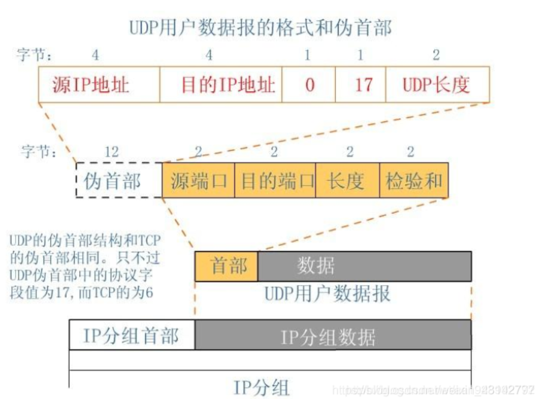

# WireShark基础

> Author: Sylvie233
>
> Date: 23/1/27

[TOC]

## 基础介绍

本机环境


架构：


### Filter

BPF语法

```
Capture Filter:
	&&、||、!
	arp:
	broadcast:
	dns:
	dst:
	ether:
	host:
	http:
	icmp:
	port:
	src:
	
Display Filter:
	and、or、not
	eq、	
	==、!=、
	arp:
	dns:
	http:
	icmp:
	ip:
		addr:
		dst:
		src:
	oicq:
	tcp:
		flag:
			ack:
			syn:
		port:
		srcport:
		stream:
	udp:
		port:
```


## 核心内容


### arp协议

默认头部28字节


### dhcp协议

### ethernet协议

数据包头14字节+尾部4字节


帧、最小帧长度为64字节

以太网、多路访问广播型数据链路层协议

以太网地址、mac地址、物理地址


CSMA/CD载波监听多路访问/冲突检测


### ftp协议

### http协议

### icmp协议

默认头部最低8字节


### igmp协议

### ip协议

默认头部最低20字节


版本：

首部长度：4字节整数倍（最小20字节、最大60字节）

区分服务tos：

数据报总长度：数据报最大长度为65535

标识：同一个包为同一个标识

标志：

- mf：大包分片
- df：禁止分片

片偏移：

生存时间：

协议：

- icmp
- igmp
- tcp
- udp

首部校验和：

源地址：

目的地址：

可选字段、填充：（得满足4字节整数倍）


ip地址分类


私网ip


子网划分


### ospf协议

动态路由协议


5种报文

- hello包
- dbd包(Database Description)
- Link State Request


3张表

- 邻居表
- LSDB表
- 路由表


路由器身份

- DR
- BDR
- DRother


OSPF域Area

区域边界做路由汇总

路由器类型

- IR
- BR
- ABR
- ASBR


### ppp协议

点对点的数据链路层协议、多用于广播域


### pppoe协议

以太网承载ppp协议、家庭宽带拨号上网


### smtp协议

### tcp协议

默认头部20字节


源端口(2)：

目的端口(2)：

seq序列号(4)：

ack确认号(4)：

Head Length(4bit)：头部长度、数据偏移

控制字(1)：

- 

窗口大小(2)：TCP流量控制

校验和(2)：

紧急指针(2)：


tcp三次握手建立连接

syn、ack


tcp确认机制


tcp滑动窗口

window


tcp四次挥手

fin、ack


### telnet协议

### tftp协议

### udp协议

默认头部8字节




## 网络硬件


