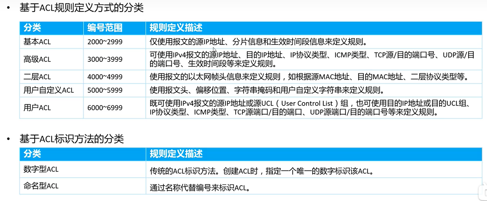
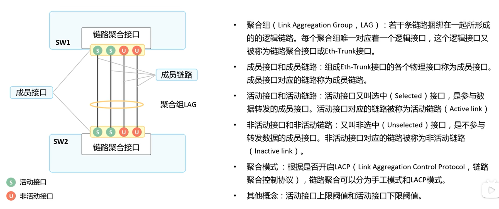
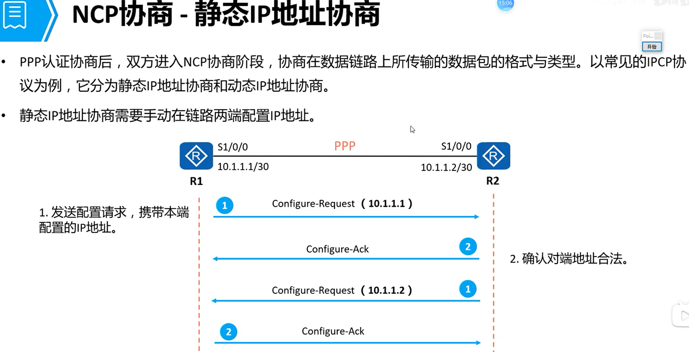
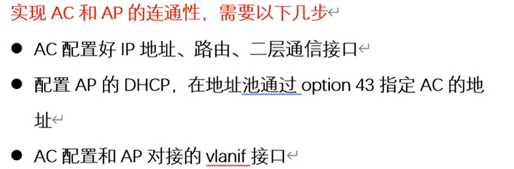

# eNSP基础

> Author: Sylvie233
>
> Date: 23/2/3
>
> Point: 
>
> ​	网工达叔最新全集：P2

[TOC]

## 基础介绍

HCIA、HCIP、HCIE


三层交换机

单臂路由


acl访问控制列表


nat网络地址转换

私网地址

```
:
	192.168.x.x:
	10.x.x.x:
	172.16.x.x~172.31.x.x:
```


datacom数据通信


Ethernet以太网：局域网技术


路由汇总


网络可靠性


### AAA

Authentication、Authorization、Accounting

用户、NAS、AAA服务器


#### RADIUS


### ACL

规则集合


通配符（反掩码）


规则编号


ACL分类




匹配规则


### 堆叠

堆叠、集群

iStack、CSS


### LACP

链路聚合、LACP




LACP


### vlan

隔离广播域、mac帧的vlan标记


Vlan虚拟局域网

交换机中使用vlan，默认划分到编号为1的vlan域中

交换机之间的Trunk模式

vlan数据帧


接口类型


**单臂路由**


**vlanif**

vlanif接口可配置ip


交换机实现三层交换


### STP

生成树、交换机、防环、二层环路、


动态响应网络拓扑变化调整阻塞接口

桥ID（BID）、根桥（BID最小值）、根端口


根桥


Cost开销


RPC根路径开销


Port ID 接口ID


BPDU


BPDU比较


STP接口状态


#### RSTP


边缘端口


#### MSTP


### telnet

```
telnet:
```


### NAT

网络地址转换


地址转换表


#### 静态NAT


#### 动态NAT

地址池


#### NAPT

利用端口转换扩大ip的利用率


#### Easy IP


NAT Server


### DHCP


租期更新


### FTP

主动模式


被动模式


#### TFTP


### DNS

DNS查询


### HTTP


### NTP

时钟同步


### PPP

wan广域网


​		


PPP链路连接


LCP协商


认证协商

PAP认证


CHAP认证


NCP协商

静态IP地址协商




#### PPPoE

以太网PPP协议


PPPoE会话


PPPoE报文


### WLAN


wifi版本


wlan组网


#### 有线侧组网


#### 无线侧组网

##### BSS、SSID、BSSID


##### VAP


##### ESS

使用同一个SSID、实现漫游


#### AC、AP

AC可用作三层交换机使用


PoE交换机


双频信号：2.4G、5G


AC与AP连接


AC与AP连通性



AC配置WLAN参数


AP加入AP组


#### CAPWAP


### 硬件

#### 交换机

##### 框式交换机


#### 路由器


## 核心内容

### 主机

```
ipconfig:
ping:
```


### 服务器

```

```


### 路由器

```
aaa: 
	local-user: 用户配置	
		ftp-directory:
			flash:
		password: 用户密码
			cipher:
		privilege: 用户级别
			level:
		service-type:
			ftp:
			telnet:
	---
	domain:
		---
		
acl:
	name:
	number:
	basic:
		rule:
			permit:
				source:
	---
	rule:
		deny:
			ip:
				destination:
				source:
				
bgp:
clock:
	datetime:
dhcp:
	enable
	
dir:
	
display:
	acl:
		all: 
	clock:
	configuration:
		candidate:
	current-configuration:
	domain:
		name:
	ip:
		interface:
		routing-table: 路由表
	ospf:
		lsdb:
		peer:
			brief:
	startup: 启动参数
	this: 显示设置
	vlan:
	
ftp:
	server:
		enable:
	---
	get:
	
info-center:
	logfile:
	
interface:
	GigabitEthernet:
		x/x/x: 指定端口
		---
		arp:
			broadcast:
				enable:
		dhcp:
			select: 选择自定义地址池
				global:
				interface:
			server:
				dns-list: 配置dns服务器ip
				excluded-ip-address:
				lease:
		dot1q: 子接口vlan配置
			termination:
				vid:
		ip:
			address: 给接口配置ip
		link-protocol:
			ppp:
		nat:
			outbound:
				address-group: 使用指定的地址池
			server:
				global:
				inside:
        ospf:
        	cost:
        ping:
        ppp:
        	authentication-mode:
        		pap:
        	pap:
        		local-user:
        		password:
        quit:
        traffic-filter: 通行过滤（应用acl）
        	inbound:
        		acl:
        	outbound:
        		acl:
    LoopBack:
    	
ip:
	policy-based-route:
	pool: 地址池
        ---
        dns-list:
        gateway-list:
        lease:
        mask:
        network:
	route-static: 静态路由配置
	
nat:
	address-group: 地址池
	
ospf:
	area:
		network:
			
	router-id:
	
reboot:

sysname: 设备名

system-view: 进入系统视图（默认用户视图）

telnet: 远程连接路由器
	server:
		enable: 开启telnet服务
		
tftp:
		
undo: 方向操作
	ip:
		address: 删除ip地址
		
		
user-interface:
	vty: 开启远程管理连接
        ---
		authentication-mode: 连接验证模式
			aaa: 账号+密码
            password:
```


### 交换机

```
acl:
	name:
	advance:
		rule:
			deny:
				ip:
					destination:
					source:
						any:
			permit:
display:
	mac-address:
	stp:
		brief:
	
interface:
	x/x/x:
	eth-trunk:
		least:
			active-linknumber:
		max:
			active-linknumber:
		mixed-rate:
		mode:
			lacp:
		trunkport:
	
	lacp:
		priority:
	mac-vlan:
		enable:
	traffic-filter:
		inbound:
			acl: 指定acl规则
				name:
    port:
        default:
            vlan: 设置端口的vlan划分
        eth-trunk:
        hybrid:
        	tagged:
        		vlan:
        	untagged:
        		vlan:
        link-type:
            access:
            trunk:
        pvid:
        	vlan:
        trunk:
            allow-pass:
                vlan:
                    all:
            pvid:    
    quit:
    stp:
    	cost:
 
lacp:
	priority:

stp:
	mode:
		stp:
		rstp:
		mstp:
	pathcost-standard:
	priority:
		
	root:
		primary:
		secondary:
		

vlan: 创建vlan区域
	batch:
```


### AC

```
capwap:
	source:
		interface:
			Vlanif:

wlan:
	---
	ap-group:
		name:
			---
			radio: 所有信号（2.4G、5G）
				all:
			vap-profile: ap组关联vap配置模板
			wlan:
	ap-id:
        ap-mac:
            ---
            ap-group: ap加入到ap组中
            ap-name:
	security-profile:
		name:
			---
			security:
				wpa-wpa2:
					psk:
						pass-phrase:
							aes:
	ssid-profile:
		name: 配置模板名称
            ---
            ssid: 配置wlan名称
    vap: vap配置信息
    	name:
    		---
    		forward-mode:
    			tunnel:
    		security-profile:
    		service-vlan:
    			vlan-id:
    		ssid-profile:
```


### AP

```

```


### VRP

华为硬件操作系统


文件系统、存储设备、


Console控制、设备调试

设备com口


